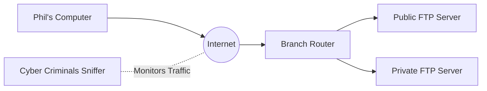

# COM398 Systems Security

# Week 10 – VPN (Transport Mode)

## Learning Objectives

- Explain what a VPN is.
- Configure a VPN client.
- Compare unencrypted and encrypted FTP traffic.
- Analyse captured packets.

---

## What is a VPN?

A Virtual Private Network (VPN) creates an encrypted tunnel across the Internet so users can securely access remote resources.

Without a VPN:
- Passwords may be visible.
- Files may be intercepted.

With a VPN:
- Traffic is encrypted.
- Data remains confidential.

---

## Today's Architecture



---

## Addressing Table

| Device | Private IP | Public IP |
|---|---|---|
| Phil's Computer | 10.44.0.2 | - |
| Branch Router | - | 209.165.201.19 |
| Public FTP Server | 10.44.2.253 | 209.165.201.20 |
| Private FTP Server | 10.44.2.254 | - |

---

## Before You Begin

Open **Week 10 PKT.pkt**.

The topology and IP configuration have already been completed.

---

# Activity 1 – Unencrypted FTP

1. Open **Cyber Criminals Sniffer** → GUI → **Clear**.
2. Open **Phil's Computer** → Desktop → Command Prompt.
3. Run:

```text
ipconfig
```

4. Connect:

```text
ftp 209.165.201.20
```

Username:

```text
cisco
```

Password:

```text
publickey
```

Upload:

```text
put PublicInfo.txt
```

5. Return to the sniffer and inspect the FTP packets.

Record:
- Username
- Password
- FTP commands
- Uploaded file

---

# Activity 2 – Configure the VPN

Desktop → VPN

| Setting | Value |
|---|---|
| Group Name | VPNGROUP |
| Group Key | 123 |
| Host IP | 209.165.201.19 |
| Username | phil |
| Password | cisco123 |

Click **Connect**.

Run:

```text
ipconfig
```

Observe the new VPN IP.

---

# Activity 3 – Encrypted FTP

```text
ftp 10.44.2.254
```

Username:

```text
cisco
```

Password:

```text
secretkey
```

Upload:

```text
put PrivateInfo.txt
```

Return to the sniffer.

Can you still read:
- Username?
- Password?
- File contents?

Explain why.

---

# Reflection

1. Why is VPN more secure than normal FTP?
2. What changed after connecting to the VPN?
3. What information became protected?

---

# Checklist

- [ ] Observed insecure FTP
- [ ] Configured VPN
- [ ] Verified VPN connection
- [ ] Sent encrypted FTP
- [ ] Compared traffic
