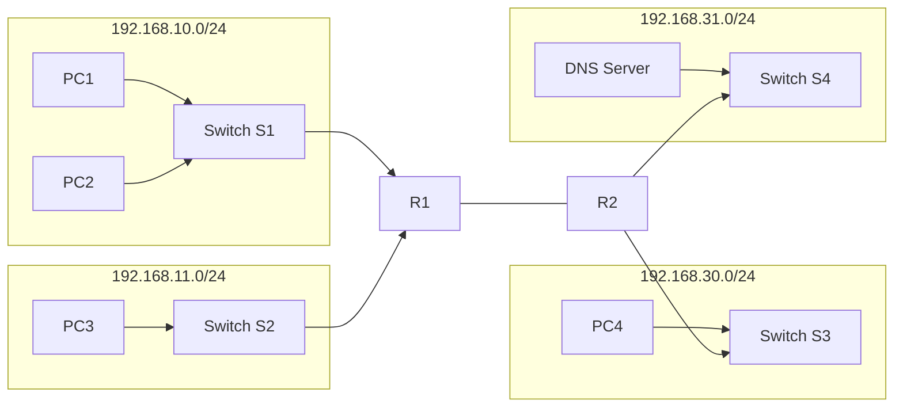

# COM398 Systems Security

# Week 9 – Access Control Lists (ACLs)

---

# Introduction

In today's seminar, we will learn how Access Control Lists (ACLs) are used to control communication between different networks.

Before configuring an ACL, a network engineer must first understand the network topology, verify device connectivity, and identify where an ACL has been applied.

During today's practical you will investigate an existing ACL, remove it, verify the network, and finally configure your own Standard IPv4 ACL.

---

# Learning Objectives

By the end of today's seminar you should be able to:

- Understand the purpose of an Access Control List (ACL)
- Identify where an ACL is configured
- Verify network connectivity
- Locate an ACL on a router
- Determine whether an ACL is applied inbound or outbound
- Remove an existing ACL
- Verify connectivity after removing an ACL
- Configure and apply a Standard IPv4 ACL

---

# Today's Practical Activities

Today's lab consists of two practical exercises.

## Activity 1

Investigate an existing ACL.

You will:

- Verify connectivity
- Locate the ACL
- Remove the ACL
- Test the network again

---

## Activity 2

Create your own Standard IPv4 ACL.

You will:

- Configure the ACL
- Apply it to the router
- Verify the configuration
- Test the completed network

---

# Network Topology

Before opening the CLI, familiarise yourself with the network.



---

# Verify the Topology

Open the supplied Packet Tracer file.

Before doing anything else, verify that your topology matches the following.

You should have:

| Device | Quantity |
|----------|----------|
| Router 1941 | 2 |
| Switch 2960-24TT | 4 |
| PCs | 4 |
| DNS Server | 1 |

The topology should contain:

- Router R1
- Router R2
- Switch S1
- Switch S2
- Switch S3
- Switch S4
- PC1
- PC2
- PC3
- PC4
- DNS Server

If anything is missing, stop and ask your seminar tutor before continuing.

---

| Device     |      IP Address |     Subnet Mask | Default Gateway |
| ---------- | --------------: | --------------: | --------------: |
| PC1        | `192.168.10.10` | `255.255.255.0` |  `192.168.10.1` |
| PC2        | `192.168.10.20` | `255.255.255.0` |  `192.168.10.1` |
| PC3        | `192.168.11.10` | `255.255.255.0` |  `192.168.11.1` |
| PC4        | `192.168.30.10` | `255.255.255.0` |  `192.168.30.1` |
| DNS Server | `192.168.31.10` | `255.255.255.0` |  `192.168.31.1` |

| Interface |     IP Address |       Subnet Mask |
| --------- | -------------: | ----------------: |
| G0/0      | `192.168.10.1` |   `255.255.255.0` |
| G0/1      | `192.168.11.1` |   `255.255.255.0` |
| S0/0/0    |     `10.1.1.1` | `255.255.255.252` |

| Interface |     IP Address |       Subnet Mask |
| --------- | -------------: | ----------------: |
| G0/0      | `192.168.30.1` |   `255.255.255.0` |
| G0/1      | `192.168.31.1` |   `255.255.255.0` |
| S0/0/0    |     `10.1.1.2` | `255.255.255.252` |


# Understanding the Networks

The topology contains four separate IPv4 networks.

| Network | Purpose |
|-----------|----------|
|192.168.10.0/24|LAN containing PC1 and PC2|
|192.168.11.0/24|LAN containing PC3|
|192.168.30.0/24|LAN containing PC4|
|192.168.31.0/24|DNS Server Network|

Routers are responsible for allowing these different networks to communicate with each other.

ACLs will later decide which communication should be permitted or denied.

---

# Step 1 — Verify PC1

Select

PC1

↓

Desktop

↓

IP Configuration

Verify that:

- IP Address belongs to the **192.168.10.0/24** network
- Subnet Mask is correct
- Default Gateway is configured

Do not modify any values.

---

# Step 2 — Verify PC2

Select

PC2

↓

Desktop

↓

IP Configuration

Verify that:

- IP Address belongs to the **192.168.10.0/24** network
- Subnet Mask is correct
- Default Gateway is configured

---

# Step 3 — Verify PC3

Select

PC3

↓

Desktop

↓

IP Configuration

Verify that:

- IP Address belongs to the **192.168.11.0/24** network
- Subnet Mask is correct
- Default Gateway is configured

---

# Step 4 — Verify PC4

Select

PC4

↓

Desktop

↓

IP Configuration

Verify that:

- IP Address belongs to the **192.168.30.0/24** network
- Subnet Mask is correct
- Default Gateway is configured

---

# Step 5 — Verify the DNS Server

Select

DNS Server

↓

Desktop

↓

IP Configuration

Verify that:

- IP Address belongs to the **192.168.31.0/24** network
- Subnet Mask is correct
- Default Gateway is configured

---

# Step 6 — Verify Router Interfaces

Select

R1

↓

CLI

Type

```text
enable
show ip interface brief
```

Verify:

- Interfaces connected to S1 are up/up.
- Interfaces connected to S2 are up/up.
- Serial interface connecting to R2 is up/up.

Repeat the same process on **R2**.

---

# Step 7 — Test Network Connectivity

Open

PC1

↓

Desktop

↓

Command Prompt

Run the ping commands provided in today's lab sheet.

Record:

- Which devices respond?
- Which devices fail?

Do not investigate yet.

Repeat the same process from:

- PC2
- PC3
- PC4

Record all observations before continuing.

---

# Step 8 — Investigate the ACL

Select

R1

↓

CLI

Enter:

```text
enable
show access-lists
```

Answer the following:

- Is an ACL configured?
- What is the ACL number?
- Which rules are present?

Next, enter:

```text
show running-config
```

Locate:

```text
ip access-group
```

Identify:

- Which interface is using the ACL?
- Is the ACL applied inbound or outbound?

Do not remove the ACL until instructed by your seminar tutor.

---

# End of Part 1

At this stage you should have:

- Verified the complete topology.
- Checked every end device.
- Confirmed router interfaces.
- Tested network connectivity.
- Located the existing ACL.
- Identified where the ACL has been applied.

In Part 2, you will remove the ACL, verify connectivity, create your own Standard IPv4 ACL, apply it to the correct interface, and test the completed network.
