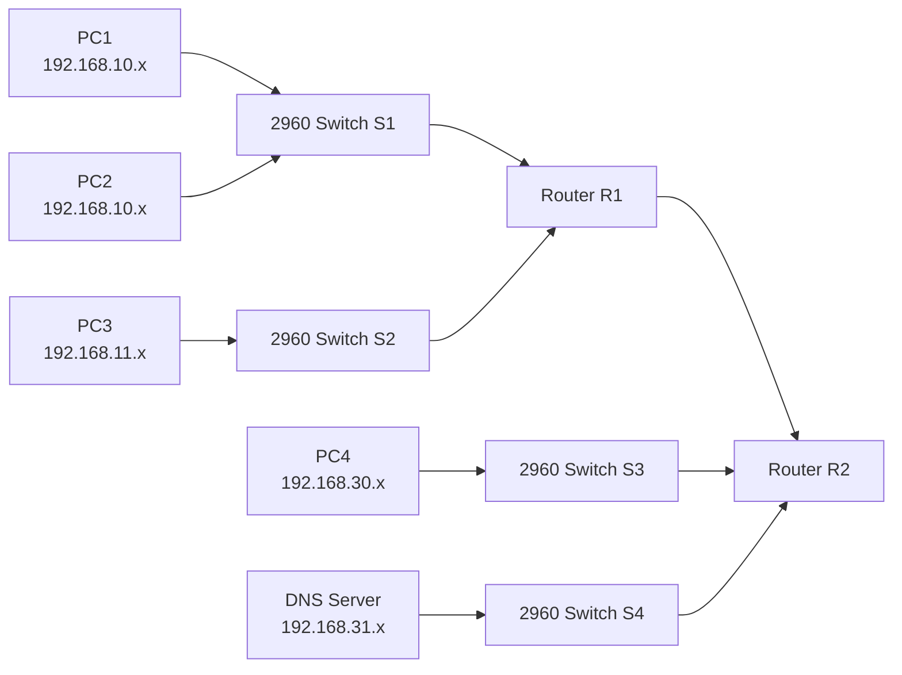
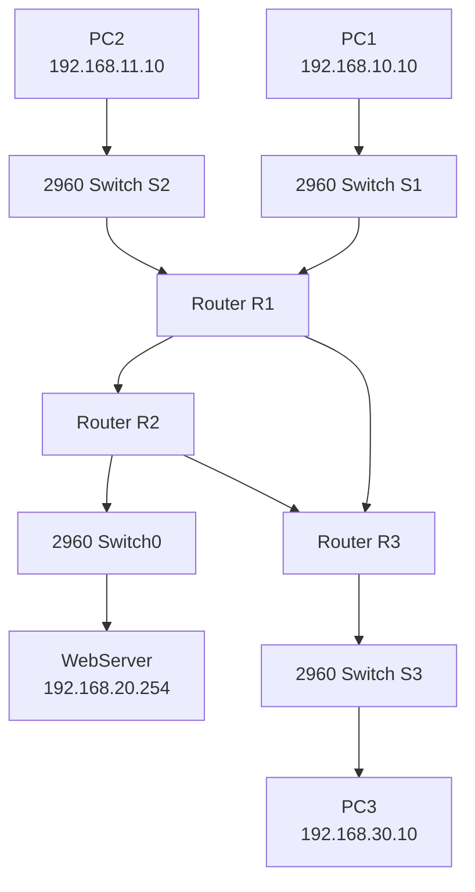

# COM398 Systems Security

# Week 9 - Access Control Lists (ACLs)

---

# What We Are Doing Today

Today you will complete two Packet Tracer activities:

1. Investigate an existing ACL that is blocking traffic.
2. Build and apply your own standard IPv4 ACLs.

The lab is practical.

You should follow the steps in order.

Do not configure an ACL before confirming that the network itself is working.

---

# Core Topics

Before starting, remember these terms:

```text
ACL
```

An Access Control List is a set of permit and deny rules used by a router to control traffic.

```text
Standard ACL
```

A standard ACL filters traffic mainly by source IPv4 address.

```text
Wildcard Mask
```

A wildcard mask tells the router which part of the address must match.

```text
0.0.0.255
```

means match the first three octets and ignore the final octet.

```text
Inbound
```

Traffic entering an interface.

```text
Outbound
```

Traffic leaving an interface.

```text
Implicit Deny
```

If traffic does not match a permit rule, it is denied automatically.

For this reason, we normally add:

```text
permit any
```

after a deny rule when all other traffic must be allowed.

---

# Practical 1 - Investigate and Remove an Existing ACL

---

# Topology

Use the Packet Tracer file supplied for **Week 9 ACL Part 1**.

Do not rebuild this topology unless your tutor asks you to.

You should see:

- Router R1
- Router R2
- Switch S1
- Switch S2
- Switch S3
- Switch S4
- PC1
- PC2
- PC3
- PC4
- DNS Server



---

# Step 1 - Open the Packet Tracer File

Open Cisco Packet Tracer.

Open the supplied file:

```text
Week 9 Lab - ACL Part 1
```

Wait for all links to become green.

Do not change any configuration.

---

# Step 2 - Check Device Addressing

Click:

```text
PC1
```

Select:

```text
Desktop
```

Open:

```text
IP Configuration
```

Record:

- IPv4 address
- Subnet mask
- Default gateway

Repeat this for:

- PC2
- PC3
- PC4
- DNS Server

Do not change any value unless the file is incomplete.

---

# Step 3 - Test Local Connectivity from PC1

Click:

```text
PC1
```

Select:

```text
Desktop
```

Open:

```text
Command Prompt
```

Ping PC2.

Use PC2's actual IP address shown in Packet Tracer.

```text
ping <PC2-IP>
```

Then ping PC3.

```text
ping <PC3-IP>
```

Record the results.

| Test | Expected Result |
|---|---|
| PC1 to PC2 | Success |
| PC1 to PC3 | Success |

---

# Step 4 - Test Remote Connectivity from PC1

From the same PC1 Command Prompt, ping PC4.

```text
ping <PC4-IP>
```

Then ping the DNS Server.

```text
ping <DNS-SERVER-IP>
```

Record the results.

| Test | Expected Result |
|---|---|
| PC1 to PC4 | Fail |
| PC1 to DNS Server | Fail |

Do not remove anything yet.

---

# Step 5 - Use Simulation Mode

At the bottom-right of Packet Tracer, change:

```text
Realtime
```

to:

```text
Simulation
```

On PC1, run the ping to PC4 again.

Use:

```text
Capture/Forward
```

to move the packet one step at a time.

Observe where the packet stops.

Return to:

```text
Realtime
```

after the test.

---

# Step 6 - Inspect R1

Click:

```text
R1
```

Select:

```text
CLI
```

Press Enter if required.

Run:

```text
enable
```

Then run:

```text
show access-lists
```

You should see ACL 11.

Expected configuration:

```text
Standard IP access list 11
 10 deny 192.168.10.0 0.0.0.255
 20 permit any
```

---

# Step 7 - Understand ACL 11

The rule:

```text
deny 192.168.10.0 0.0.0.255
```

blocks traffic whose source address belongs to:

```text
192.168.10.0/24
```

The wildcard mask:

```text
0.0.0.255
```

means:

```text
Match 192.168.10
Ignore the final octet
```

Therefore, addresses such as these are matched:

```text
192.168.10.1
192.168.10.25
192.168.10.100
192.168.10.254
```

The rule:

```text
permit any
```

allows all other source addresses.

---

# Step 8 - Find Where the ACL Is Applied

On R1, run:

```text
show running-config
```

Look for:

```text
ip access-group 11 out
```

You should find the ACL applied to:

```text
Serial0/0/0
```

as an outbound ACL.

You can also run:

```text
show ip interface serial0/0/0
```

Look for the outgoing access list.

---

# Step 9 - Remove the ACL from the Interface

Enter global configuration mode:

```text
configure terminal
```

Enter the serial interface:

```text
interface serial0/0/0
```

Remove the ACL from the interface:

```text
no ip access-group 11 out
```

Exit interface configuration mode:

```text
exit
```

---

# Step 10 - Delete ACL 11

Still in global configuration mode, run:

```text
no access-list 11
```

Exit:

```text
end
```

---

# Step 11 - Verify the ACL Has Been Removed

Run:

```text
show access-lists
```

ACL 11 should no longer appear.

Run:

```text
show running-config
```

Confirm that:

```text
ip access-group 11 out
```

is no longer present.

---

# Step 12 - Repeat the Ping Tests

Return to PC1.

Open:

```text
Desktop
```

then:

```text
Command Prompt
```

Ping PC4 again:

```text
ping <PC4-IP>
```

Ping the DNS Server again:

```text
ping <DNS-SERVER-IP>
```

Expected result:

| Test | Expected Result |
|---|---|
| PC1 to PC4 | Success |
| PC1 to DNS Server | Success |

---

# Practical 1 Checkpoint

You should now have completed the following:

- Tested local connectivity
- Tested remote connectivity
- Identified ACL 11
- Identified the wildcard mask
- Found the ACL on Serial0/0/0
- Confirmed it was applied outbound
- Removed the ACL from the interface
- Deleted ACL 11
- Verified remote connectivity

---

# Practical 2 - Configure Standard IPv4 ACLs

---

# Activity Goal

You will configure two standard ACLs.

Policy 1:

```text
192.168.11.0/24 must not access the WebServer.
All other traffic must be permitted.
```

Policy 2:

```text
192.168.10.0/24 must not access 192.168.30.0/24.
All other traffic must be permitted.
```

---

# Topology

Use the supplied Packet Tracer file for **Week 9 ACL Part 2**.

You should see:

- Router R1
- Router R2
- Router R3
- Switch S1
- Switch S2
- Switch S3
- Switch0
- PC1
- PC2
- PC3
- WebServer



---

# Addressing Table

## R1

| Interface | IP Address | Subnet Mask |
|---|---|---|
| G0/0 | 192.168.10.1 | 255.255.255.0 |
| G0/1 | 192.168.11.1 | 255.255.255.0 |
| S0/0/0 | 10.1.1.1 | 255.255.255.252 |
| S0/0/1 | 10.3.3.1 | 255.255.255.252 |

## R2

| Interface | IP Address | Subnet Mask |
|---|---|---|
| G0/0 | 192.168.20.1 | 255.255.255.0 |
| S0/0/0 | 10.1.1.2 | 255.255.255.252 |
| S0/0/1 | 10.2.2.1 | 255.255.255.252 |

## R3

| Interface | IP Address | Subnet Mask |
|---|---|---|
| G0/0 | 192.168.30.1 | 255.255.255.0 |
| S0/0/0 | 10.3.3.2 | 255.255.255.252 |
| S0/0/1 | 10.2.2.2 | 255.255.255.252 |

## End Devices

| Device | IP Address | Subnet Mask | Default Gateway |
|---|---|---|---|
| PC1 | 192.168.10.10 | 255.255.255.0 | 192.168.10.1 |
| PC2 | 192.168.11.10 | 255.255.255.0 | 192.168.11.1 |
| PC3 | 192.168.30.10 | 255.255.255.0 | 192.168.30.1 |
| WebServer | 192.168.20.254 | 255.255.255.0 | 192.168.20.1 |

---

# Step 1 - Open the Part 2 Packet Tracer File

Open the supplied Packet Tracer file.

Wait for all links to become green.

Do not configure ACLs yet.

---

# Step 2 - Verify PC1 Configuration

Click:

```text
PC1
```

Select:

```text
Desktop
```

Open:

```text
IP Configuration
```

Confirm:

```text
IP Address: 192.168.10.10
Subnet Mask: 255.255.255.0
Default Gateway: 192.168.10.1
```

---

# Step 3 - Verify PC2 Configuration

Click:

```text
PC2
```

Select:

```text
Desktop
```

Open:

```text
IP Configuration
```

Confirm:

```text
IP Address: 192.168.11.10
Subnet Mask: 255.255.255.0
Default Gateway: 192.168.11.1
```

---

# Step 4 - Verify PC3 Configuration

Click:

```text
PC3
```

Select:

```text
Desktop
```

Open:

```text
IP Configuration
```

Confirm:

```text
IP Address: 192.168.30.10
Subnet Mask: 255.255.255.0
Default Gateway: 192.168.30.1
```

---

# Step 5 - Verify WebServer Configuration

Click:

```text
WebServer
```

Select:

```text
Desktop
```

Open:

```text
IP Configuration
```

Confirm:

```text
IP Address: 192.168.20.254
Subnet Mask: 255.255.255.0
Default Gateway: 192.168.20.1
```

---

# Step 6 - Verify Router Interfaces

For each router:

1. Click the router.
2. Open `CLI`.
3. Run `enable`.
4. Run:

```text
show ip interface brief
```

Confirm that the interfaces match the addressing table.

Do not continue if the required interfaces are down.

---

# Step 7 - Verify Full Connectivity Before ACLs

From PC1, run:

```text
ping 192.168.11.10
ping 192.168.30.10
ping 192.168.20.254
```

From PC2, run:

```text
ping 192.168.30.10
ping 192.168.20.254
```

From PC3, run:

```text
ping 192.168.20.254
```

All tests should succeed before ACLs are configured.

---

# Policy 1 - Block PC2 Network from the WebServer

The source network is:

```text
192.168.11.0/24
```

The destination is the WebServer network:

```text
192.168.20.0/24
```

Because this is a standard ACL, it checks the source address.

Apply it close to the destination.

The ACL will be configured on R2 and applied outbound on:

```text
GigabitEthernet0/0
```

---

# Step 8 - Configure ACL 1 on R2

Click:

```text
R2
```

Select:

```text
CLI
```

Run:

```text
enable
```

Then:

```text
configure terminal
```

Create the deny rule:

```text
access-list 1 deny 192.168.11.0 0.0.0.255
```

Permit all other traffic:

```text
access-list 1 permit any
```

---

# Step 9 - Apply ACL 1 on R2

Enter:

```text
interface gigabitethernet0/0
```

Apply the ACL outbound:

```text
ip access-group 1 out
```

Exit:

```text
end
```

---

# Step 10 - Verify R2 ACL

Run:

```text
show access-lists
```

Expected:

```text
Standard IP access list 1
 deny 192.168.11.0 0.0.0.255
 permit any
```

Run:

```text
show ip interface gigabitethernet0/0
```

Confirm that ACL 1 is applied outbound.

---

# Policy 2 - Block PC1 Network from PC3 Network

The source network is:

```text
192.168.10.0/24
```

The destination network is:

```text
192.168.30.0/24
```

Configure the standard ACL on R3.

Apply it outbound on:

```text
GigabitEthernet0/0
```

---

# Step 11 - Configure ACL 1 on R3

Click:

```text
R3
```

Select:

```text
CLI
```

Run:

```text
enable
```

Then:

```text
configure terminal
```

Create the deny rule:

```text
access-list 1 deny 192.168.10.0 0.0.0.255
```

Permit all other traffic:

```text
access-list 1 permit any
```

---

# Step 12 - Apply ACL 1 on R3

Enter:

```text
interface gigabitethernet0/0
```

Apply the ACL outbound:

```text
ip access-group 1 out
```

Exit:

```text
end
```

---

# Step 13 - Verify R3 ACL

Run:

```text
show access-lists
```

Run:

```text
show ip interface gigabitethernet0/0
```

Confirm that ACL 1 is applied outbound.

---

# Step 14 - Test the Completed ACL Configuration

## From PC1

```text
ping 192.168.11.10
```

Expected:

```text
Success
```

```text
ping 192.168.20.254
```

Expected:

```text
Success
```

```text
ping 192.168.30.10
```

Expected:

```text
Fail
```

## From PC2

```text
ping 192.168.20.254
```

Expected:

```text
Fail
```

```text
ping 192.168.30.10
```

Expected:

```text
Success
```

## From PC3

```text
ping 192.168.20.254
```

Expected:

```text
Success
```

---

# Final Test Table

| Source | Destination | Expected |
|---|---|---|
| PC1 | PC2 | Success |
| PC1 | WebServer | Success |
| PC2 | WebServer | Fail |
| PC1 | PC3 | Fail |
| PC2 | PC3 | Success |
| PC3 | WebServer | Success |

---

# Troubleshooting

## ACL Exists but Does Not Work

Run:

```text
show access-lists
```

Then:

```text
show running-config
```

Check whether the ACL is applied using:

```text
ip access-group 1 out
```

---

## All Traffic Is Blocked

Check that you added:

```text
access-list 1 permit any
```

Without this command, the implicit deny blocks all unmatched traffic.

---

## Wrong Network Is Blocked

Check the source network in the ACL.

R2 should use:

```text
192.168.11.0 0.0.0.255
```

R3 should use:

```text
192.168.10.0 0.0.0.255
```

---

## ACL Applied in the Wrong Direction

Check:

```text
show ip interface gigabitethernet0/0
```

The ACL should be applied:

```text
outbound
```

---

# Command Summary

## View ACLs

```text
show access-lists
```

## View Running Configuration

```text
show running-config
```

## View Interface ACL Information

```text
show ip interface
```

or:

```text
show ip interface gigabitethernet0/0
```

## Remove ACL from an Interface

```text
interface serial0/0/0
no ip access-group 11 out
```

## Delete ACL 11

```text
no access-list 11
```

## Create R2 ACL

```text
access-list 1 deny 192.168.11.0 0.0.0.255
access-list 1 permit any
interface gigabitethernet0/0
ip access-group 1 out
```

## Create R3 ACL

```text
access-list 1 deny 192.168.10.0 0.0.0.255
access-list 1 permit any
interface gigabitethernet0/0
ip access-group 1 out
```

---

# End of Lab Checklist

## Practical 1

- Opened the correct Packet Tracer file
- Verified local connectivity
- Verified remote connectivity
- Found ACL 11
- Identified the wildcard mask
- Found the interface and direction
- Removed the ACL from the interface
- Deleted ACL 11
- Retested connectivity

## Practical 2

- Verified PC addresses
- Verified default gateways
- Verified router interfaces
- Confirmed full connectivity before ACLs
- Configured ACL 1 on R2
- Applied ACL 1 outbound on R2 G0/0
- Configured ACL 1 on R3
- Applied ACL 1 outbound on R3 G0/0
- Verified both ACLs
- Completed all six ping tests
