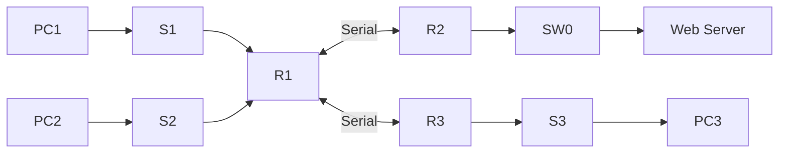

# COM398 Systems Security
# Week 9 – Access Control Lists (ACLs)

---

# Introduction

Today we will learn how Access Control Lists (ACLs) control communication between networks.

In this lab you will:
- Verify network connectivity.
- Identify an existing ACL.
- Remove an ACL and test connectivity.
- Configure your own Standard IPv4 ACL.
- Apply it to the correct router interface.
- Verify that the ACL behaves as expected.

---

# Network Topology



---

# Addressing Table

| Device | Interface | IP Address | Subnet Mask | Gateway |
|---------|-----------|------------|-------------|---------|
| PC1 | NIC | 192.168.10.10 | 255.255.255.0 | 192.168.10.1 |
| PC2 | NIC | 192.168.11.10 | 255.255.255.0 | 192.168.11.1 |
| PC3 | NIC | 192.168.30.10 | 255.255.255.0 | 192.168.30.1 |
| Web Server | NIC | 192.168.20.254 | 255.255.255.0 | 192.168.20.1 |
| R1 G0/0 | |192.168.10.1|255.255.255.0| |
| R1 G0/1 | |192.168.11.1|255.255.255.0| |
| R2 G0/0 | |192.168.20.1|255.255.255.0| |
| R3 G0/0 | |192.168.30.1|255.255.255.0| |

> If the Packet Tracer file already contains these values, verify them only. Do not modify them unless instructed.

---

# Activity 1 – Investigate an Existing ACL

## Step 1 – Open the Lab
1. Open Cisco Packet Tracer.
2. Open **Week 9 Lab – ACL Part 1.pkt**.

## Step 2 – Check the Devices
Confirm you can see:
- Router R1
- Router R2
- Router R3
- Switch S1, S2, S3
- Web Server
- PC1, PC2 and PC3

## Step 3 – Verify PC IP Configuration
For **PC1**, **PC2**, **PC3**:
- Click PC
- Desktop
- IP Configuration
- Check IP Address, Subnet Mask and Default Gateway match the table.

## Step 4 – Test Connectivity
Open **Command Prompt** on each PC.

Run:
```text
ping 192.168.11.10
ping 192.168.20.254
ping 192.168.30.10
```

Record which succeed and which fail.

## Step 5 – Investigate the Router

Click **R1 → CLI**

```text
enable
show access-lists
show running-config
```

Answer:
- Which ACL number exists?
- Which interface uses the ACL?
- Is it inbound or outbound?

## Step 6 – Remove the ACL
Follow the lab sheet instructions to remove the ACL.

Verify:
```text
show access-lists
show running-config
```

## Step 7 – Test Again

Repeat every ping.

Record:
- Which devices can communicate now?
- What changed?

---

# Activity 2 – Configure Your Own ACL

Open:
**Week 9 Lab – ACL Part 2.pkt**

## Step 1
Verify:
- PCs
- Routers
- Web Server
- IP addresses
- Gateways

## Step 2
Open:
**R2 → CLI**

```text
enable
configure terminal
```

## Step 3
Create the Standard ACL exactly as instructed in the lab sheet.

## Step 4
Apply the ACL to the required interface.

## Step 5
Repeat on **R3** if required.

## Step 6 – Verify

```text
show access-lists
show running-config
show ip interface
```

## Step 7 – Test

Run ping tests between:
- PC1 ↔ PC2
- PC1 ↔ Web Server
- PC2 ↔ Web Server
- PC1 ↔ PC3
- PC2 ↔ PC3
- PC3 ↔ Web Server

Record Pass/Fail and explain why.

---

# Troubleshooting

If a ping fails:
1. Check the PC IP address.
2. Check the subnet mask.
3. Check the default gateway.
4. Verify router interface IPs.
5. Verify ACL configuration.
6. Verify the interface where the ACL is applied.
7. Verify whether the ACL is inbound or outbound.

---

# End of Lab Checklist

- [ ] Verified topology
- [ ] Verified IP addressing
- [ ] Tested connectivity
- [ ] Investigated an ACL
- [ ] Removed an ACL
- [ ] Configured a Standard ACL
- [ ] Applied the ACL correctly
- [ ] Verified using show commands
- [ ] Tested the completed network
